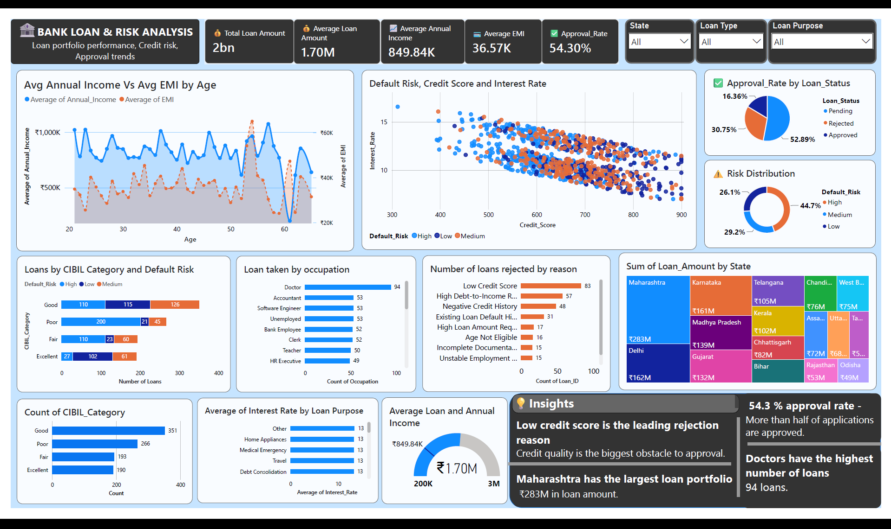

# 🏦 Bank Loan Risk Analysis Dashboard

An interactive **Power BI dashboard** built to analyze bank loan applications, customer profiles, loan approvals, credit risk, and lending patterns. This project demonstrates data visualization, business intelligence, and analytical storytelling using Power BI.

---

## 📊 Dashboard Preview



---

# 📌 Project Objective

The objective of this project is to analyze loan application data and identify trends related to:

- Loan approval rates
- Credit score distribution
- Default risk
- Customer income
- Interest rates
- Loan amounts
- Geographic distribution of loans
- Reasons for loan rejection

The dashboard helps financial institutions understand customer behavior and make data-driven lending decisions.

---

# 📂 Dataset

The dataset contains information about bank loan applicants including:

- Customer Age
- Annual Income
- Loan Amount
- Existing Loan Amount
- EMI
- Credit Score
- CIBIL Category
- Default Risk
- Loan Status
- Loan Type
- Occupation
- State
- Loan Purpose
- Interest Rate
- Rejection Reason

---

# 📈 Dashboard Features

### Key Performance Indicators (KPIs)

- Average Annual Income
- Average EMI
- Average Existing Loan Amount
- Loan Approval Rate

### Interactive Filters

- Loan Type
- State
- Loan Status

### Visualizations

- Annual Income vs EMI by Age
- Credit Score vs Interest Rate (Scatter Plot)
- Loan Approval Status
- CIBIL Category Distribution
- Loan Rejection Reasons
- Loan Amount by State (Treemap)
- Loans by Occupation
- Interest Rate by Loan Purpose
- Loans by CIBIL Category and Default Risk

---

# 🔍 Key Insights

- Maharashtra has the highest total loan amount among all states.
- Applicants with lower credit scores generally receive higher interest rates.
- Low Credit Score is the leading reason for loan rejection.
- Customers with Good CIBIL scores represent the largest applicant segment.
- Loan approval rate is over 54%, indicating a balanced lending portfolio.
- Interest rates remain relatively consistent across different loan purposes.

---

# 🛠 Tools & Technologies

- Power BI Desktop
- Power Query
- DAX
- CSV Dataset

---

# 📚 Skills Demonstrated

- Data Cleaning
- Data Transformation
- Data Modeling
- DAX Calculations
- KPI Design
- Interactive Dashboard Development
- Business Intelligence
- Data Visualization
- Analytical Storytelling

---

# 📁 Project Structure

```
Bank-Loan-Risk-Analysis/
│
├── Dashboard/
│   └── Bank Loan Dashboard.pbix
│
├── Dataset/
│   └── Bank_Loan_Dataset.csv
│
├── Images/
│   └── dashboard.png
│
└── README.md
```

---

# 🚀 How to Use

1. Download the repository.
2. Open the `.pbix` file using Power BI Desktop.
3. Refresh the data if required.
4. Use the slicers to explore different loan segments.
5. Interact with charts to gain business insights.

---

# 🎯 Business Value

This dashboard enables decision-makers to:

- Monitor loan approval performance
- Evaluate customer creditworthiness
- Identify high-risk borrowers
- Understand regional lending trends
- Analyze reasons for loan rejection
- Support data-driven lending strategies

---

If you have any suggestions or feedback, feel free to connect with me through GitHub.

---

⭐ If you found this project useful, consider giving it a Star.
